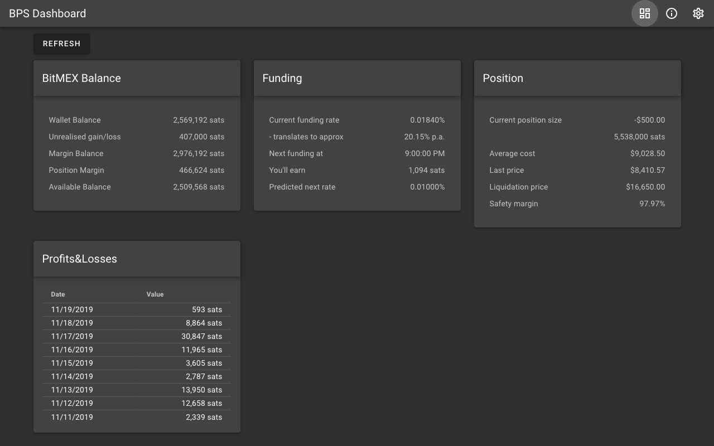

# BitMEX Perpetual Swap Dashboard

This tool can be used to monitor your position when you are using [BitMEX](https://www.bitmex.com/register/wJ5Z4a) Perpetual Swap to hedge against Bitcoin price fluctuations. For more details, [read my article](https://taborsky.cz/posts/2019/hedging-bitcoin-volatility/).

It's fairly experimental, though I use it myself. I am a really bad developer, mind you.



## Security

The tool is inteded to be used locally, due to the sensitive nature of data it handles. Although it does not send anything anywhere other than the BitMEX API, you should not trust me on that. You should inspect the source code, ideally, so that you'll understand what it does.

## How to use
- Clone the repository to your drive.
- Install dependencies by running:
    ```
    npm install
    ```
- Launch the app:
    ```
    npm run serve
    ```
- Navigate to http://localhost:8080
- Generate a read-only API key and secret on the BitMEX website.
- Because BitMEX does not allow by default access to their API with browsers (by not sending CORS headers), you need to find a suitable CORS proxy or run one yourself. If you have the source code of this project, you can run one by running this in a separate terminal window:

  ```
  npm run proxy
  ```

  It will listen on port 8081 and settings are pre-filled with this proxy address. The proxy uses [CORS Anywhere](https://github.com/Rob--W/cors-anywhere/), where you can find a lot more info.
- Go to the [settings page](settings) and enter the key and secret there.
- Return to the Dashboard, hit REFRESH and you should see your info pulled from BitMEX.
- Check the Javascript console in case it does not work.
- The dasboard will auto update every 30 seconds.

## Author

Written by [Michal Taborsky](https://taborsky.cz/about).

## Project setup

```
npm install
```

### Compiles and hot-reloads for development

```
npm run serve
```

### Compiles and minifies for production

```
npm run build
```

### Lints and fixes files

```
npm run lint
```
